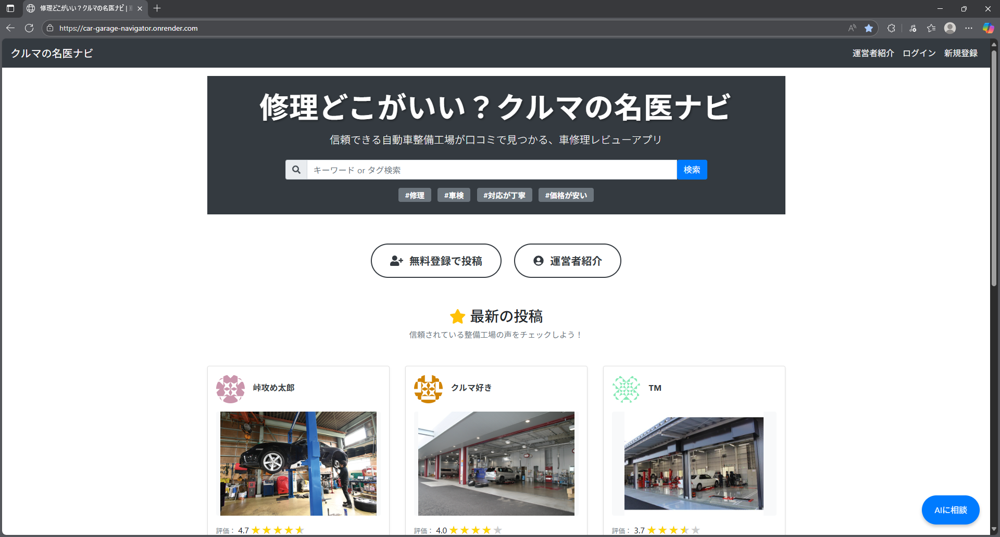
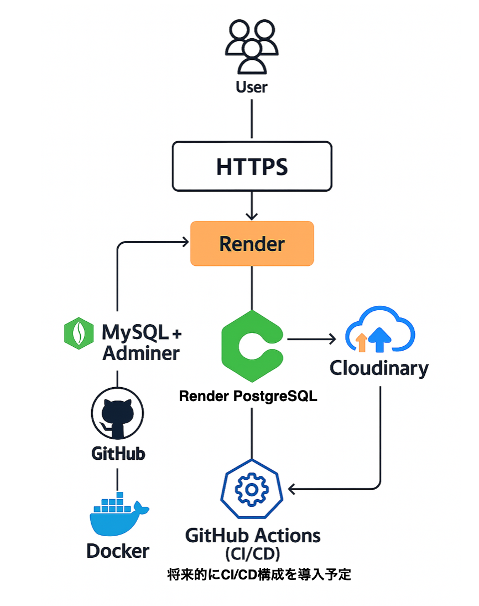

# 修理どこがいい？クルマの名医ナビ（Car Garage Navigator）

信頼できる整備工場を口コミで探せるWebアプリです。
4人チームで開発し、このリポジトリはたつのりのポートフォリオ用に管理しています。

URL: [Car Garage Navigator](https://car-garage-navigator.onrender.com)

## サイトイメージ

## 主な機能

- ユーザー機能（登録・ログイン・編集・退会）
- フォロー機能 & タイムライン切替
- 投稿（整備工場の口コミ投稿）
- 投稿への画像添付
- タグ機能（表示・投稿・編集・削除・検索）
- レビュー機能（表示・投稿・編集・削除）
- 星評価（項目別の5段階評価）
- 投稿検索（キーワード・タグ）
- Google Mapsでの店舗位置表示
- チャットボット連携
- 操作完了メッセージ表示 (フラッシュメッセージ)
- レスポンシブ対応（スマホ対応含む）

## 使用技術

### バックエンド
- Laravel 6（PHP）
- 本番：PostgreSQL（Render内DB）
- ローカル：MySQL + Adminer

### フロントエンド
- Blade, Sass（SCSS記法）, Bootstrap 4, FontAwesome, JavaScript

### 環境構築・インフラ
- Docker（ローカル開発）
- MySQL + Adminer（ローカルDB構成／Docker上で動作）
- Render（本番ホスティング）
- Render PostgreSQL（本番DBとして使用）
- Laravel ローカルストレージ（開発環境で画像保存に使用）
- Cloudinary（画像ストレージ／本番環境）
- HTTPS（Render による自動SSL対応）
- GitHub Actions（将来的にCI/CD構成を導入予定）

### 外部サービス・API
- Google Maps API
- Botpress Chatbot

### 画像アップロードについて
投稿画像のアップロードには、環境ごとにストレージを切り替えています。
- **本番環境**：Cloudinary を使用し、投稿画像をクラウドで配信
- **ローカル環境**：Laravel のローカルストレージ（`storage/app/public`）を利用し、`php artisan storage:link` によって公開ディレクトリと連携
環境に応じた設定は `.env` ファイルで管理しています。
## アーキテクチャ構成図
本アプリは、以下のような構成で開発・公開を行っています。

- **User**：ブラウザからアクセスするユーザー
- **Render によるSSL対応**：HTTPS化により安全な通信を実現
- **Render**：Laravelアプリをホスティング（ルーティング／認証／データ処理など）
- **PostgreSQL**：Render内のDBとして利用
- **Cloudinary**：投稿画像のアップロード・配信を担当
- **GitHub**：チームでのバージョン管理／レビュー用
- **Docker**：ローカル開発環境を統一
- **GitHub Actions（CI/CD）**：将来的に自動デプロイ導入予定
## テーブル定義
本アプリで使用している主なテーブルの定義は以下の通りです：

## 担当と役割（@たつのり）
このリポジトリは、チーム開発で制作したアプリをもとに、
私（たつのり）が実装・調整を担当した内容をまとめたポートフォリオ用のものです。
以下の機能・領域を中心に担当しました：
- ユーザーテーブルのマイグレーション・シーダー作成
- トップページの投稿表示(アバター、ユーザー名、投稿日時実装)
- 投稿新規作成
- トップページのレイアウト作成
- フォロー機能：ユーザー詳細ページにボタン移設、フォロー一覧、フォロワー数の表示
- フォローによるタイムライン変更（フォローしているユーザーの投稿表示）
- 画像アップロード：Cloudinary連携（本番環境）
- Google Maps API：店舗検索・地図表示
- Renderデプロイ (https対応／SSL証明書自動発行）

## 学び・工夫した点
- コントローラ・ビュー・モデルを整理しながら実装を進め、機能の責務を明確に分離することで、保守しやすい構成を意識しました。
- 投稿・フォロー・画像などの関連機能を、Eloquentのリレーションを活用して整理し、モデル設計とロジックの共通化によってデータ処理を効率化しました。
- バリデーションやアクセサ、Eloquentの機能、ヘルパー関数を積極的に活用し、コードの可読性とデータの整合性を高めました。
- 複数機能が連携する場面では、命名の一貫性やロジックの整理を意識し、可読性と保守性を高めました。
- Google Maps APIサービスを利用して、ユーザー体験の向上を意識しました。
- 機能の追加や修正がしやすいよう、構造の見通しやすさと命名の統一を常に意識しました。
- データベース操作では、無駄なクエリやN+1問題を回避し、パフォーマンスとスケーラビリティを意識した実装を心がけました。

## GitHubの活用
- Gitフローに沿って、機能ごとにブランチを細かく分けて開発を進めました。
- ブランチ名は feature/tatsunori/create_new_post のようにルールを統一し、どんな作業かすぐに分かるように心がけました。
- 実装のたびにこまめにコミットし、プルリクエストを通じてチームとしっかり連携。マージ前には、コードの差分確認や動作確認も丁寧に行いました。
- 担当したブランチに関して、それぞれの進捗を整理しながら、スムーズな開発を意識して取り組みました。
- コンフリクトが起きた際は、他のメンバーの変更内容を確認しながら、内容がぶつからないよう丁寧に統合しました。マージの順番やまとめ方にも気を配り、チーム全体のコードが安定するよう心がけました。
- 最終的にRenderでのデプロイを行い、チーム全体が本番環境で動作確認を行える体制を整備しました。

## チームメンバー
- たつのり← 本リポジトリの管理者（ポートフォリオ用に個人で運用）
- ちゃこ
- なり
- 清水

## ブランチについて
- develop_b_satsuki_sna: チーム開発で完成した全機能統合版
- release/1.0: ポートフォリオ向けに整理・調整したブランチ（Cloudinary連携・本番構成・README整備など）
※このREADMEは release/1.0 ブランチで管理されています。

## 制作期間
- 2ヶ月
## 注意事項
掲載情報はすべてダミーであり、実在する店舗・人物・サービスとは一切関係ありません。
※このアプリは Laravel フレームワークをベースに開発しています。

cense](https://opensource.org/licenses/MIT).
